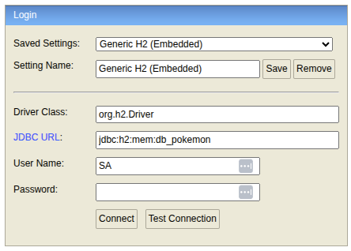

# Pokemon
Expone un **Web Service SOAP** que ofrece métodos relacionados con Pokémon. Internamente, el servicio actúa como un adaptador y consume la API pública de [PokeAPI](https://pokeapi.co/api/v2/pokemon/) , transformando las respuestas REST en operaciones accesibles vía SOAP.

Adicionalmente se expone una **API Rest** que también consume internamente la API de Pokemon y expone el detalle de un Pokémon por su nombre.

Se han configurado dos perfiles uno para trabajar con la BD h2 y otro con mysql.

### Setup
- La variable de entorno `ENV_PORT` ha sido configurada para arrancar por el `8081`


- Use esta ENV para acceder a la consola h2, disponible en: http://localhost:8081/h2-console



- Se debe ejecutar el siguiente comando para que se cree el `XSD` automáticamente y posteriormente se levante el WS usando la BD de H2
  ```bash
  mvn clean generate-resources spring-boot:run -Dspring-boot.run.profiles=h2
  ```
  
- Para activar persistencia con `mysql` entonces hacer run con el siguietne comando que activa este perfil:
  ```bash
  mvn clean generate-resources spring-boot:run -Dspring-boot.run.profiles=mysql
  ```

- Para el caso del **Webservice SOAP**:
    - El **WSDL** está expuesto en: `http://localhost:8081/ws/pokemon.wsdl`
    - API First Swagger: 


- Para el caso de la **API Rest**, se tienen:
    - JSON del OpenAPI (documentación en crudo): http://localhost:8081/api-docs
    - Interfaz de Swagger UI (navegable en el navegador): http://localhost:8081/swagger-ui/index.html


- Para todo el **CASE** se ha confeccionado una colección de **Postman** que cuenta con una **Suite de pruebas**
Para los servicios expuestos via **REST** y vía **SOAP**.