# Pokemon

Expone un **Web Service SOAP** que ofrece métodos relacionados con Pokémon. Internamente, el servicio actúa como un adaptador y consume la API pública de [PokeAPI](https://pokeapi.co/api/v2/pokemon/), transformando las respuestas REST en operaciones accesibles vía SOAP.

Adicionalmente se expone una **API Rest** que también consume internamente la API de Pokemon y expone el detalle de un Pokémon por su nombre.

Se han configurado dos perfiles: uno para trabajar con la BD **H2** y otro con **MySQL**.

---

## Índice

- [SetUp y arranque del sistema](#setup-y-arranque-del-sistema)
- [Tests y reportes](#tests-y-reportes)
- [Assets / Imágenes incluidas](#assets--im%C3%A1genes-incluidas)
- [Arranque con Docker](#run-con-docker)

---

# SetUp y arranque del sistema

Esta sección contiene todo lo necesario para levantar la aplicación, cambiar entre perfiles (H2 / MySQL), y acceder a las interfaces expuestas (SOAP, REST, documentación, consolas y herramientas externas como SonarQube).

### 1. Variables de entorno

- `ENV_PORT` — configurada para arrancar en el puerto `8081`.

> Nota: usa esta ENV si quieres acceder a la consola H2 en `http://localhost:8081/h2-console`.


### 2. Arrancar la aplicación (generación automática de XSD)

- Arranque con **H2** (genera XSD automáticamente y levanta el WS usando la BD en memoria H2):

```bash
  mvn clean generate-resources spring-boot:run -Dspring-boot.run.profiles=h2
```

- Arranque con **MySQL** (activa persistencia con MySQL):

```bash
  mvn clean generate-resources spring-boot:run -Dspring-boot.run.profiles=mysql
```


### 3. Web Service SOAP

- El **WSDL** está expuesto en:

```
http://localhost:8081/ws/pokemon.wsdl
```

### 4. API REST y documentación

- JSON del OpenAPI (documentación cruda):

```
http://localhost:8081/api-docs
```

- Interfaz navegable Swagger UI:

```
http://localhost:8081/swagger-ui/index.html
```


### 5. Colección Postman

Se ha confeccionado una colección de **Postman** que incluye una **suite de pruebas** implementada con JS, para los servicios REST y SOAP.

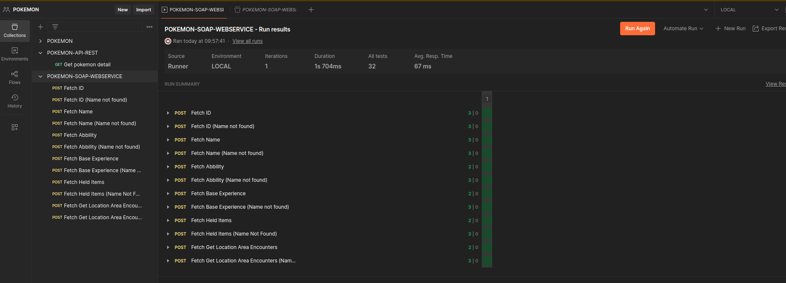


### 6. Persistencia de trazas / Logs

Se persisten las trazas del log para facilitar debugging y auditoría:

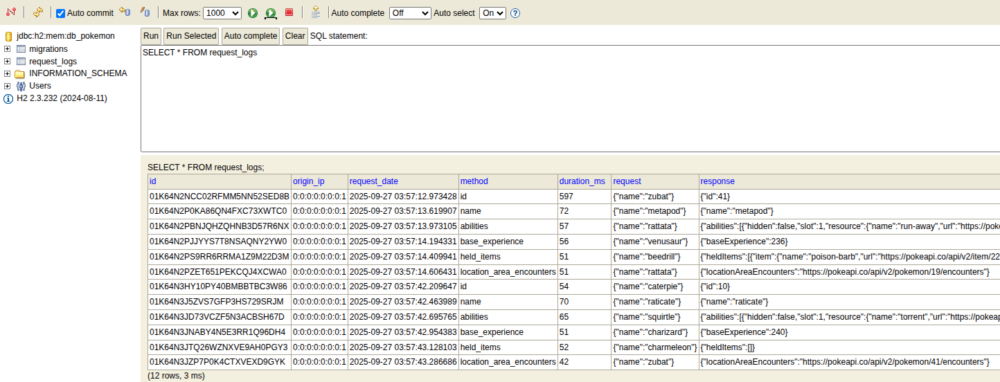


### 7. SonarQube — análisis estático

Se ha incluido un `docker-compose` para levantar SonarQube (con H2) y facilitar el análisis del proyecto.

- Levantar SonarQube:

```bash
  docker compose up -d
```

- URL (por defecto):

```
http://localhost:9000
```

- Credenciales por defecto (al ingresar por primera vez te pedirá cambiar la contraseña):
  - Usuario: `admin`
  - Password: `admin`

- Crear un TOKEN en: `http://localhost:9000/account/security`

- Ejecutar análisis con Maven (sustituye `<TOKEN>` por el token generado):

```bash
  mvn clean verify sonar:sonar \
    -Dsonar.projectKey=pokemon \
    -Dsonar.host.url=http://localhost:9000 \
    -Dsonar.token=<TOKEN>
```

- Resultados del análisis:

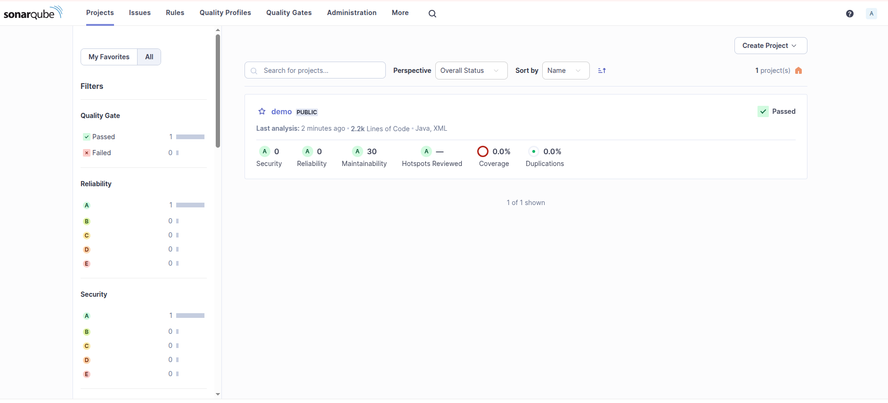

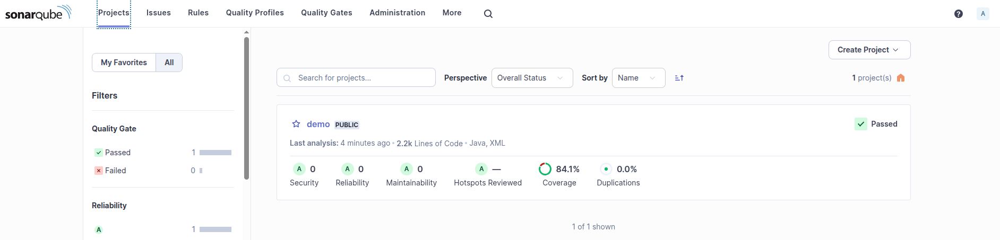


---

# Tests y reportes

A continuación se describe todo lo relacionado con pruebas: unitarias, integración, aceptación (Cucumber), Postman (colecciones y suites) y los reportes generados.

### 1. Ejecutar pruebas (comando general)

- Ejecutar todas las pruebas dentro del ciclo de Maven:

```bash
  mvn test
```

- Para ejecutar el ciclo completo (tests + verify + sonar):

```bash
  mvn clean verify sonar:sonar \
    -Dsonar.projectKey=pokemon \
    -Dsonar.host.url=http://localhost:9000 \
    -Dsonar.token=<TOKEN> \
    -Dcucumber.publish.enabled=true
```

### 2. Postman

- La colección de Postman cubre servicios REST y SOAP y contiene una Suite de pruebas (ver imagen):


*(Importa la colección en Postman para ejecutar todas las requests y tests automáticos que se adjuntan en la carpeta [documentation](documentation))*

### 3. Tests unitarios

- Se han implementado pruebas unitarias:

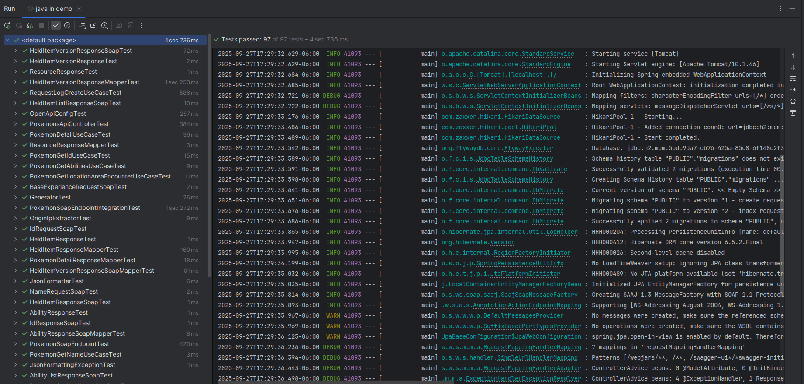


### 4. Tests de integración

- Prueba de integración destacada: `PokemonSoapEndpointIntegrationTest`.

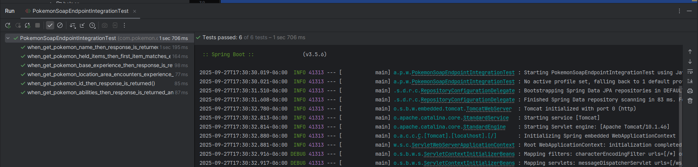


### 5. Pruebas de aceptación / Cucumber

- Se han implementado pruebas de aceptación e integración usando **Cucumber**.

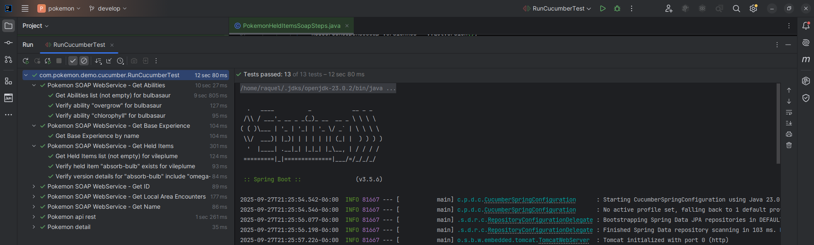

- Reporte generado:

Al ejecutar el comando con `cucumber.publish.enabled=true` se expone un enlace temporal con el resultado del análisis:
```bash
  mvn clean verify sonar:sonar \
    -Dsonar.projectKey=pokemon \
    -Dsonar.host.url=http://localhost:9000 \
    -Dsonar.token=<TOKEN> \
    -Dcucumber.publish.enabled=true
```
Por ejemplo:
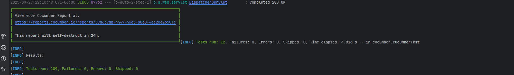
Y al acceder a ` https://reports.cucumber.io/reports/59d637db-4447-46e5-88c0-4ae2de2b50fe` vemos el resultado del análisis de los test con cucumber:
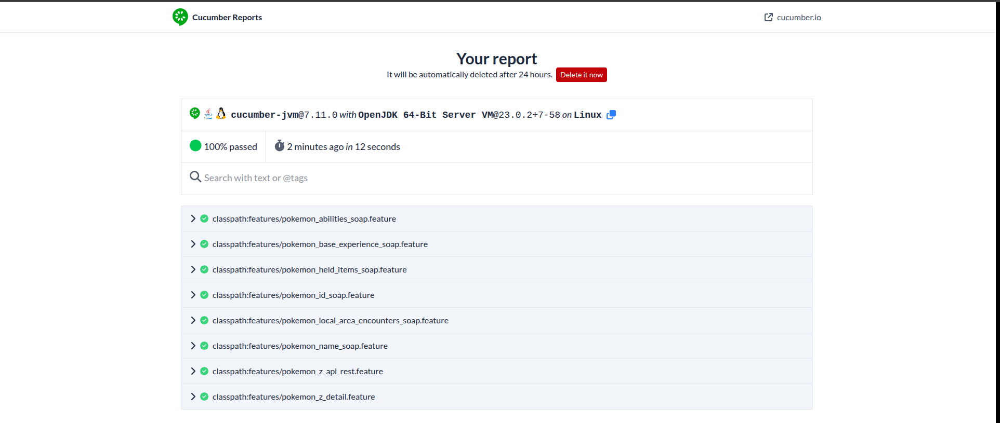


---

# Assets / Imágenes incluidas

Las siguientes imágenes están referenciadas por el README (asegúrate de mantener la carpeta `images/` con estos ficheros):

- `images/h2-console.png`
- `images/postman-suite.png`
- `images/request-log-h2.png`
- `images/sonarqube.png`
- `images/sonarqube-2.png`
- `images/unit-test.png`
- `images/integration-test.png`
- `images/cucumber-test.png`
- `images/cucumber-report.png`


---

# Run con Docker
Ejecutar el comando
```bash
  docker compose up --build
```
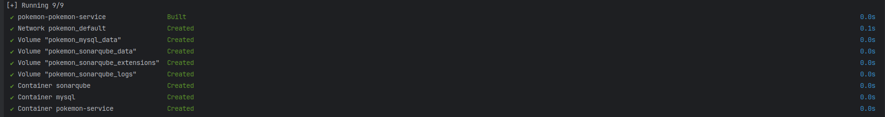

En local se configuró por 8081 y para docker el 8080 
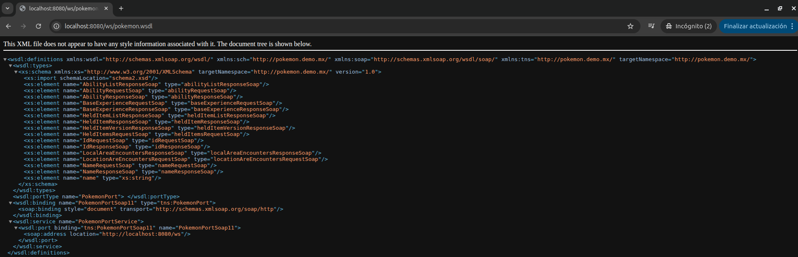
Y se hizo un test con postman
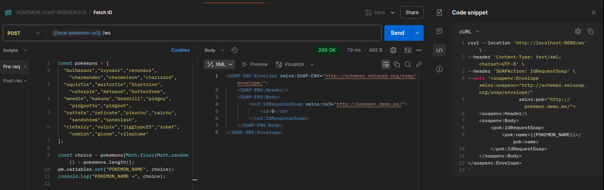
